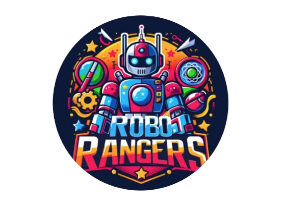

<div align="center">

<br/><br/><br/>



<br/><br/><br/>

<!-- Badges -->
![FLL Challenge](https://img.shields.io/badge/FIRST%20LEGO%20League-Challenge-1a6fb5?style=for-the-badge&logo=data:image/png;base64,iVBORw0KGgoAAAANSUhEUgAAAA4AAAAOCAYAAAAfSC3RAAABCGlDQ1BJQ0MgUHJvZmlsZQAAeJxjYGA8wQAELAYMDLl5JUVB7k4KEZFRCuwPGBiBEAwSk4sLGHADoKpv1yBqL+viUYcLcKakFicD6Q9ArFIEtBxopAiQLZIOYWuA2EkQtg2IXV5SUAJkB4DYRSFBzkB2CpCtkY7ETkJiJxcUgdT3ANk2uTmlyQh3M/Ck5oUGA2kOIJZhKGYIYnBncAL5H6IkfxEDg8VXBgbmCQixpJkMDNtbGRgkbiHEVBYwMPC3MDBsO48QQ4RJQWJRIliIBYiZ0tIYGD4tZ2DgjWRgEL7AwMAVDQsIHG5TALvNnSEfCNMZchhSgSKeDHkMyQx6QJYRgwGDIYMZAKbWPz9HbOBQAAACVElEQVR4nGWRS0tUYQCGn+/75sw5o3M1dGqEJMcu08WEbtJi0AIpqCBbt2lp6MKoSKKfINUiEgIxaCHkJog2EkFgJJkWQUwkmKJSoOmcM+OZyzlfCy0IX3g2Lzyb90VJqQHdeapdPzjeroH/EOGk5uwdLUAj5L8+wFYi0Qh9q0VysQSyt4fujjMsLS/QM7aIsa+DlbV5xNQztFTgewTQm2KLaZGTLgMtGYp7M7z8+pGZUoZj2YOcK79mMHuVnyvziLm3aCGRWvugJE0+/Eru4Fv/dey+Xu7dHWJkcplLxhStB5ppzg0TvzgA8d2gNVID1NRQ7/nooMlCS5of6TTPL3QTrK/n8ZOnxGJxpianaaiLkm7aBWyJZm0tKcNgJr9O55FWTredYHZ8mP2V79x+NMp63qac7ad56RWLX94jhCQAEA9HSCmDttkck8MjZIcecnTmGuONOzGNANkXgpN7LD4P32fDAyH0ptiYSODaDrfmZhm7eYPLn6Y539XF1MQEb959IHXoCvOjgyytOkgp8X0fAB2trdVxK7Ttw7+0Hc5s/9cMmroukcBHoytVkAKlAlimyZqdx91wiYTDKKUQAoSQAMhQKEQ4FKLslghaJmbQJGgYuKUSdbE4qWQSyzQpFAooKamxLFzXJRA0DISQGIaBQOB5HkoplFI4BYdq1SMRi1GulHEKRbTWrPxeRYYsi7xjYzsOAaXQgBQCyzTJ2w5FdwOtNeFwmJBlUq5UEUIglZSs23nKlTKe3lzLLjgUigWi0QiphiS+77OezyOloup5APwBFuH1c6ozRfsAAAAASUVORK5CYII=&logoColor=white&labelColor=0d1b2a)


<br/><br/>

</div>

---

## 🤖 Who We Are

We are the **Robo Rangers**, a passionate *First LEGO League Challenge* team from **Joinville, Santa Catarina, Brazil**. We are driven by curiosity, teamwork, and the belief that young engineers can solve real-world problems — one brick at a time.

From designing and coding autonomous robots to researching meaningful innovations, we pour creativity and determination into everything we build. And we're just getting started.

### 👩‍🏫 Coach
**Gilmara dos Santos**

### 👾 Team Members

**Guilherme Gon Wiemes**<br/>
**Luis Claudio Rocha**<br/>
**Gabrielli Casanova Zatta**<br/>
**Isabella Leite Pereira**<br/>
**Letícia Melchioretto**<br/>

---

## 🏆 Our Achievements

### 🌍 UNEARTHED Season — 2025/2026

| Award | Tournament | Result |
|-------|-----------|--------|
| 🥇 **Champions Award** | Regional Tournament — Santa Catarina | **1st Place** |
| 🇧🇷 **National Tournament** | Festival SESI Educação — Brazil | **12th Place** |
| ✈️ **International Qualifier** | Georgia Ramblin' Robots Tournament — Atlanta, GA | **June 2026** |

### 🌊 SUBMERGED Season — 2024/2025

| Award | Tournament |
|-------|-----------|
| 🤝 **Peers Award** | Regional Tournament — Santa Catarina |

---

## 🚀 From Joinville to Atlanta

> *We qualified for the **Georgia Ramblin' Robots Tournament** in Atlanta, Georgia — competing on the international stage in June 2026. Representing not just our team, but our city and our country.*

---

## 📂 What You'll Find Here

```
robo-rangers/
├── 🤖  robot/          # Autonomous robot code & configurations
├── 📋  project/        # Innovation project documentation & research
├── 🎯  strategy/       # Mission strategy notes & field maps
└── 📸  media/          # Team photos, videos, and event galleries
```

---

## 🛠️ Our Tech Stack


---

## 🌟 Our Core Values

> *At the heart of FIRST LEGO League are the **Core Values** — and they define how we work, compete, and grow together.*

- 🤝 **Discovery** — We explore new skills and ideas
- 💡 **Innovation** — We use creativity and persistence to solve problems
- 🤲 **Impact** — We apply what we learn to improve our world
- ✨ **Inclusion** — We respect each other and embrace our differences
- ⚡ **Teamwork** — We are stronger together
- 🎉 **Fun** — We enjoy and celebrate what we do

---

<div align="center">

**Robo Rangers** • Joinville, Santa Catarina, Brazil 🇧🇷

*Building the future, one brick at a time.*

</div>


